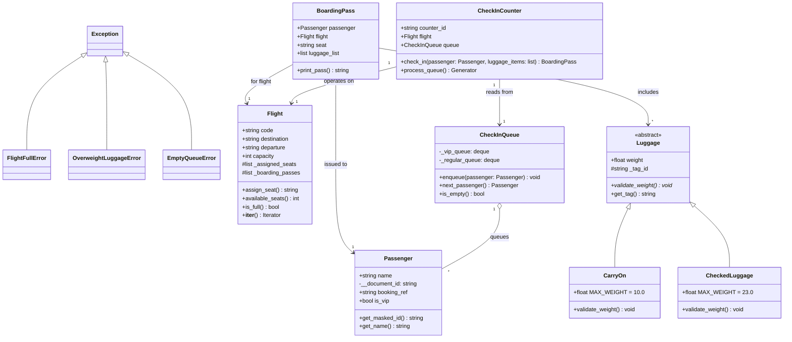

# Airport Check-In System

Sistema de gestion de check-in y abordaje para un aeropuerto desarrollado en Python 3, aplicando principios avanzados de Programacion Orientada a Objetos (POO) como encapsulamiento, herencia, polimorfismo, abstraccion, excepciones personalizadas, estructuras de datos y evaluacion perezosa (generadores).

---

## Arquitectura y Estructura del Proyecto

El proyecto esta organizado como un paquete modular en Python (`airport/`) junto con un script de entrada principal (`main.py`):

```text
Airport-Checking/
├── airport/                # Paquete principal del dominio
│   ├── __init__.py         # Inicializador del paquete
│   ├── models.py           # Passenger, Flight, BoardingPass, Luggage (CarryOn, CheckedLuggage)
│   ├── queueing.py         # CheckInQueue con prioridad VIP
│   ├── counter.py          # CheckInCounter y procesamiento de colas
│   └── exceptions.py       # Excepciones personalizadas del sistema
├── main.py                 # Script integrador y demostracion de casos de uso
└── README.md               # Documentacion del repositorio
```



## Tecnologias y Conceptos Aplicados

- **Lenguaje:** Python 3.10+
- **Encapsulamiento:** Atributos privados (`__document_id`) y protegidos (`_assigned_seats`, `_boarding_passes`) para seguridad de datos.
- **Polimorfismo y Abstraccion:** Uso de `abc.ABC` y `@abstractmethod` en la jerarquia de equipajes (`Luggage`).
- **Estructuras de Datos:** Manejo de colas de doble extremo (`collections.deque`) para implementar prioridad VIP en la atencion.
- **Protocolos Iteradores:** Implementacion de `__iter__()` en la clase `Flight` para recorrer pases de abordar de forma limpia.
- **Generadores (`yield`):** Evaluacion perezosa en `process_queue()` dentro del mostrador.
- **Manejo de Excepciones:** Errores de dominio definidos en `exceptions.py` (`FlightFullError`, `OverweightLuggageError`, `EmptyQueueError`).

---

## Instalacion y Ejecucion

No se requieren dependencias externas para ejecutar el proyecto, solo una instalacion estandar de Python.

1. **Clonar el repositorio:**
   ```bash
   git clone https://github.com/ngodoya/Airport-Checking.git

   cd Airport-Checking
   ```
   **Ejecutar la demostracion principal:**
```bash
python main.py
```
## Casos de Uso Demostrados en `main.py`

Al ejecutar el script principal, se validan de forma automatica los siguientes flujos de negocio:

1. **Prioridad VIP:** Procesamiento preferencial de pasajeros con flag `is_vip=True` independientemente de su orden de llegada.
2. **Validacion de Equipaje:** Rechazo de atencion por `OverweightLuggageError` al superar los limites de peso permitidos (10 kg en equipaje de mano, 23 kg en bodega).
3. **Emision de Boarding Pass:** Generacion de pase de abordar visual con datos de documento enmascarados (ejemplo: `******4050`).
4. **Control de Capacidad:** Captura de `FlightFullError` al intentar registrar mas pasajeros de la capacidad permitida por el vuelo.
5. **Iteracion de Vuelo:** Recorrido mediante ciclo `for` sobre la lista de pases del vuelo utilizando el iterador del objeto.
6. **Manejo de Cola Vacia:** Captura de `EmptyQueueError` al solicitar atencion sin clientes en espera.