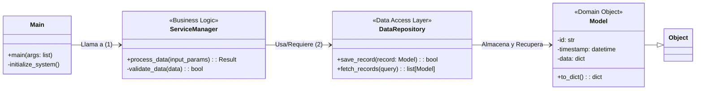

# ⚙️ Project Name | Análisis de Sistema Modular v1.0

## 📜 Resumen del Proyecto

Este repositorio alberga la documentación central y el código base para un sistema avanzado de análisis modular diseñado para gestionar, procesar y visualizar datos complejos en múltiples capas. El objetivo principal es demostrar un patrón arquitectónico limpio, desacoplado y mantenible, facilitando futuras expansiones y pruebas unitarias robustas.

El proyecto sigue los principios del **Modelo de Capas (N-Tier Architecture)**, asegurando que las preocupaciones (concerns) estén separadas lógicamente: desde la interacción con el usuario hasta la manipulación física de datos persistentes.

---

## 🔬 Arquitectura por Capas (Layered Architecture)

Hemos implementado una arquitectura estructurada en tres capas principales, lo que garantiza un alto grado de cohesión interna y bajo acoplamiento entre módulos.

### 1. Capa de Presentación (Presentation Layer / UI/API)
Esta capa es el punto de entrada del sistema. Se encarga únicamente de la interfaz de usuario o la exposición de la API. Su responsabilidad es recibir peticiones externas, validarlas superficialmente y delegar las tareas de negocio a la capa de Servicio. **No debe contener lógica de negocio.**

### 2. Capa de Lógica de Negocio (Business Logic Layer / Service)
Es el corazón del sistema. Aquí residen todas las reglas operacionales (`if`s, cálculos, validaciones complejas). La `ServiceManager` se encarga de coordinar los flujos de trabajo, orquestando llamadas entre la capa de presentación y la capa de acceso a datos. Mantiene la integridad transaccional de la aplicación.

### 3. Capa de Acceso a Datos (Data Access Layer / Persistence)
Esta capa es el único módulo que interactúa directamente con cualquier fuente de almacenamiento persistente (bases de datos, archivos JSON/CSV, etc.). Implementa patrones como Repository Pattern para abstraer las consultas y operaciones CRUD, aislando la lógica de negocio de los detalles específicos del *driver* de la base de datos.

---

## 🏗️ Diagrama de Clases UML (Mermaid)

El siguiente diagrama visualiza la estructura estática de nuestro código, mostrando cómo las clases interactúan entre sí a través de la orquestación definida en el modelo de capas.



**Notas del Diagrama:**
*   `Main`: Es el punto de inicialización.
*   `ServiceManager`: Depende de `DataRepository` para la persistencia, pero no sabe *cómo* se guardan los datos (acoplamiento bajo).
*   `Model`: Representa la entidad de dominio pura, utilizada por todas las capas.

---

## 🚀 Guía de Ejecución (Usage Instructions)

Para asegurar que el entorno operativo coincida con la documentación, siga estos pasos rigurosos:

### Prerrequisitos
Asegúrese de tener instalado Python 3.8 o superior.

```bash
# Verificar instalación de Python
python --version
```

### Instalación de Dependencias (Virtual Environment)
Es altamente recomendado trabajar dentro de un entorno virtual para aislar las dependencias del proyecto.

```bash
# Crear y activar el entorno virtual
python -m venv venv
source venv/bin/activate  # En Linux/macOS
venv\Scripts\activate    # En Windows
```

### Ejecución Principal del Sistema
El punto de entrada (`main`) se invoca ejecutando la clase principal.

```bash
python main.py [argumentos opcionales]
```

---
***Fin de Documentación Técnica***